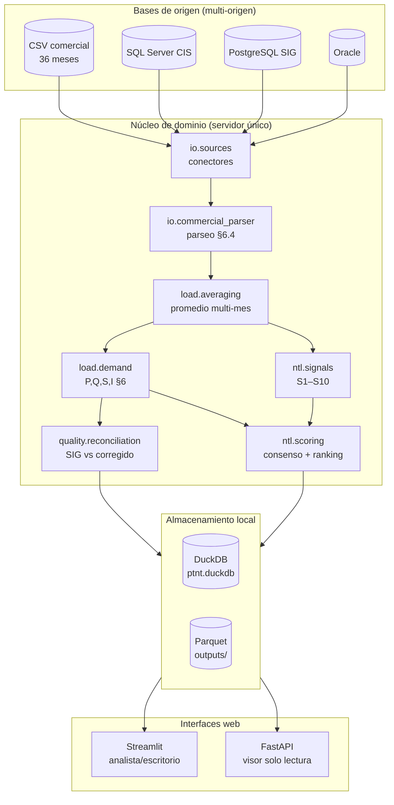

# Arquitectura — PTNT-BAL

## 1. Principios

1. **Servidor único, sin servicios distribuidos.** Todo corre en un proceso o en
   un pool de procesos locales. No hay dependencia obligatoria de una base
   cliente-servidor propia: el almacenamiento local es DuckDB + Parquet.
2. **Multi-origen desacoplado.** El consumo y el modelo de datos pueden venir de
   varias bases (CSV comercial, SQL Server, PostgreSQL, Oracle, MySQL, Parquet).
   Cada origen implementa la misma interfaz `SourceConnector`, de modo que agregar
   una base nueva no toca la lógica de negocio.
3. **Nada codificado en duro.** Umbrales, factores, coeficientes tarifarios,
   tolerancias y rutas viven en YAML validado. Un parámetro físico obligatorio
   ausente detiene el arranque con un error que lo nombra.
4. **Trazabilidad y reproducibilidad.** Cada corrida registra su `config_hash` y
   un snapshot completo de la configuración efectiva en `meta.run`.
5. **Separación medido / inferido.** El consumo facturado es un hecho; la
   ubicación del hurto es una inferencia. El sistema nunca presenta una inferencia
   como medición.

## 2. Vista de componentes



## 3. Modelo de datos: esquema Puesto → Unidad

El modelo distingue **Puesto** (ubicación geográfica única, feature de punto) de
**Unidad** (tabla de atributos, 1..N por Puesto, sin geometría propia). Tratarlo
mal produce errores sistemáticos de capacidad y pérdidas.

```
EstructuraSoporte (poste)
  └── PuestoTransfDistribucion (puesto)          POTENCIAKVA, MEDIDO, ...
        └── UNIDADTRANSFDISTRIBUCION × 1..3       (una por fase)
  └── PuntoCarga (puesto de cliente)
        └── CONEXIONCONSUMIDOR × 1..N             (clientes/medidores)
              └── ATRIBUTOSCONSUMIDOR (1:1)       CUENTACONTRATO, CLIRLSCOD,
                                                  POTENCIAACTIVA, CLIULTCONM
```

**Consecuencias implementadas:**

- El **grupo par** de un cliente para la señal S5 se define por `CLIRLSCOD`
  (grupo de ruta de lectura) + clase tarifaria — el campo que el usuario pidió
  usar como agrupador. Está mapeado a `grupo_lectura` en la configuración
  (`comercial.columnas.grupo_lectura`) y consumido por `ntl.signals` y `scoring`.
- La **dispersión intra-puesto** (S8) compara unidades del mismo
  `PuntoCarga`/puesto de transformación.
- La energía y potencia se calculan por **unidad** y se agregan al **puesto**.

El DDL completo (esquemas `meta`, `ref`, `silver`, `gold`) está en
[`src/ptnt/store/schema.sql`](../src/ptnt/store/schema.sql), tomado del modelo
entregado, y ya soporta las etapas de red que quedan como hoja de ruta.

## 4. El problema del “último mes” y su corrección

El SIG calcula `POTENCIAACTIVA`/`POTENCIAREACTIVA` de `ATRIBUTOSCONSUMIDOR` a
partir de `CLIULTCONM` (consumo del **último mes**). Esto es frágil y, para
clientes **no residenciales** (comercial, industrial) cuyo consumo es estacional
o intermitente, produce una potencia sistemáticamente sesgada.

**Corrección (cadena `averaging → demand → reconciliation`):**

1. `load.averaging` calcula un **consumo representativo** por cliente sobre la
   ventana multi-mes con un método robusto configurable (por defecto media
   recortada 10 %, que descarta un mes atípico).
2. `load.demand` aplica Velander `P_max = a·E + b·√E`, la reactiva por `cosφ` de
   clase, y la corriente **según la configuración de fase real** (`CDAFAS`),
   evitando el error del √3.
3. `quality.reconciliation` compara la potencia previa del SIG contra la
   corregida y **descompone la diferencia por causa**.

## 5. Detección de hurto (PNT)

Ninguna señal individual es concluyente; el valor predictivo está en la
coincidencia. `ntl.signals` calcula, sobre la serie de 36 meses:

| Señal | Lógica |
|---|---|
| S1 | Caída sostenida y recuperación posterior |
| S3 | Ruptura de nivel (change point) hacia abajo, sin causa comercial |
| S4 | Cero sostenido **con servicio activo** (discrimina suspensiones legítimas) |
| S5 | Consumo bajo el percentil de su **grupo par CLIRLSCOD** + clase |
| S7 | Planitud anómala (consumo fijo declarado) |
| S8 | Dispersión intra-puesto: muy por debajo de sus vecinos del transformador |

`ntl.scoring` combina las señales con detección no supervisada (IsolationForest)
por **consenso de rangos**, y produce el ranking con score, energía recuperable
estimada y las tres razones principales en lenguaje operativo.

## 6. Modelo de ejecución

- **Núcleo vectorizado** en numpy/pandas; el recálculo de potencia y las señales
  operan sobre matrices, no en bucles de Python por cliente cuando es posible.
- **Alimentador como unidad de partición** para el escalado (el pipeline acepta
  filtrar por alimentador; el generador sintético produce varios).
- **Persistencia idempotente**: DuckDB aplica el esquema con `CREATE ... IF NOT
  EXISTS`; los resultados se materializan con `CREATE OR REPLACE`.
- **Checkpoint/reproducibilidad**: `config_hash` + `meta.run` permiten verificar
  que dos corridas con la misma entrada y configuración producen el mismo
  resultado.

## 7. Interfaces

| Interfaz | Tecnología | Usuario | Capacidad |
|---|---|---|---|
| Tablero de escritorio | Streamlit | Analista (`analyst`/`admin`) | Explora ranking, reconciliación, detalle de cliente; descarga XLSX/CSV |
| Visor de resultados | FastAPI | Terceros (`viewer`) | Solo lectura: portada, ranking top-N, API JSON |

Ambas leen **solo de las salidas ya calculadas** (DuckDB/Parquet); no ejecutan el
pipeline pesado. La seguridad se detalla en [SEGURIDAD.md](SEGURIDAD.md).

## 8. Hoja de ruta (etapas de red de la especificación)

Estas etapas están especificadas y el esquema las soporta; quedan para las
siguientes iteraciones sobre esta base:

- **Topología y trazas** (`rustworkx`): grafo por alimentador, asignación de
  clientes a transformadores por traza vs. declarado.
- **Flujo de potencia** (barrido atrás/adelante + OpenDSS) y validación IEEE
  13/34/123.
- **Pérdidas técnicas por componente** (MT, transformadores vacío/carga, BT,
  neutro, acometidas, medidores, AP) con Monte Carlo P10/P50/P90.
- **Balance jerárquico** con energía de cabecera y separación MEDIDO/INDICATIVO.
