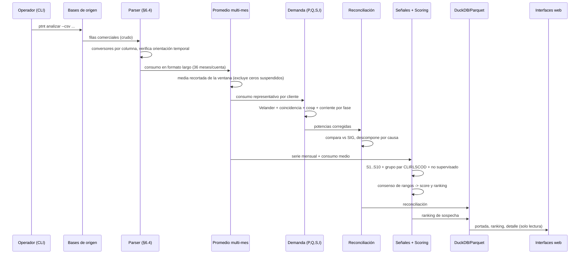

# Cómo trabaja el proceso — PTNT-BAL

Descripción del flujo de trabajo de punta a punta: qué entra, qué hace cada
etapa, qué produce y cómo se encadenan.

## Diagrama de secuencia



## Etapa por etapa

### 1. Ingesta comercial (`io/commercial_parser.py`)

**Entrada:** archivo/tabla comercial con columnas `DIVISION`, `CUENTACONTRATO`,
`DESTARI` (tarifa), `ZZUTM_X/Y`, `CLIRLSCOD` (grupo de lectura), `CLIULTCONM`
(último consumo) y `KWH_1..KWH_36`.

**Trampas que resuelve:**
- El `.` es **separador de miles** en `KWH_*` (`"1.302"` → 1302) pero **decimal**
  en coordenadas (`"621077.988"` → 621077.988). Se usan conversores por columna.
- La **orientación temporal** de `KWH_1..36` se verifica correlacionando contra
  `CLIULTCONM`; si está invertida, **aborta** en lugar de corregir en silencio.
- Valida rangos plausibles por clase (detecta error de separador de miles).

**Salida:** consumo en **formato largo** (una fila por cuenta-mes) + tabla de
clientes con su grupo de lectura, coordenadas y tarifa.

### 2. Promedio multi-mes (`load/averaging.py`)

**Por qué:** el consumo de un solo mes es frágil. Se calcula un **consumo
representativo** por cliente sobre la ventana (por defecto 12 meses) con el método
configurado. Por defecto **media recortada 10 %**: descarta el mes más alto y el
más bajo, robusta ante un mes atípico (vacaciones, lectura estimada, corte).

Métodos: `media`, `media_recortada`, `mediana`, `media_ponderada` (recencia),
`estacional` (corrige estacionalidad promediando por mes-calendario).

**Reglas:** los ceros de clientes con servicio **suspendido** se excluyen; las
lecturas estimadas pueden excluirse; si quedan menos de `min_meses_validos`, el
promedio se marca **no confiable**.

### 3. Recálculo de potencia (`load/demand.py`)

Para cada cliente, con la energía representativa:

```
P_media = E / (dias × 24)
P_max   = a·E + b·√E            (Velander, por clase tarifaria)
Q       = P_max · tan(arccos(cosφ_clase))
S       = √(P_max² + Q²)
I       = S·1000 / V            (V según configuración de fase: 1F, 2F, 3F)
```

Corrige los dos errores del SIG: usar el último mes como base y aplicar mal el
factor √3 (que subestima la corriente monofásica en 42 %).

### 4. Reconciliación (`quality/reconciliation.py`)

Compara la `POTENCIAACTIVA`/`POTENCIAREACTIVA` previas del SIG contra las
corregidas, agregando por división y clase, y **descompone la diferencia por
causa**: energía-vs-demanda, factor √3, coincidencia, cosφ, días del período,
factor de multiplicación. Es el primer entregable de credibilidad.

### 5. Señales de hurto (`ntl/signals.py`)

Sobre la serie de 36 meses de cada cliente calcula S1, S3, S4, S5, S7, S8
(intensidad 0–1 + evidencia). Discrimina el cero legítimo (servicio suspendido)
del sospechoso (servicio activo). El **grupo par** para S5 es `CLIRLSCOD` + clase.

### 6. Scoring y ranking (`ntl/scoring.py`)

Combina las señales por **consenso de rangos** con una detección no supervisada
(IsolationForest). Produce el ranking con `score`, `recuperable_kwh_mes`,
`n_senales_activas` y las tres `razones` en lenguaje operativo.

### 7. Persistencia (`store/database.py`)

Materializa el ranking y la reconciliación en DuckDB (`resultados.*`) y en
Parquet (`outputs/`), y registra la corrida en `meta.run` con su `config_hash`
para reproducibilidad.

### 8. Interfaces (`dashboard/`, `webviewer/`)

Leen las salidas ya calculadas. El tablero es para el analista (interactivo,
descargable); el visor es de solo lectura para terceros.

## Reejecución e idempotencia

Misma entrada + misma configuración ⇒ mismo `config_hash` ⇒ mismo resultado. La
persistencia usa `CREATE OR REPLACE`, así que reejecutar es seguro y sobreescribe
la corrida anterior conservando el histórico en `meta.run`.
