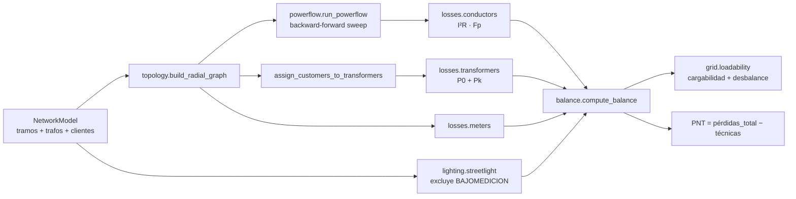

# Etapas de red eléctrica (E4–E10)

Documenta la vía de red del sistema: de la topología al balance de energía y la
PNT. Se ejecuta con `ptnt analizar-red` (sobre red sintética) o desde
`ptnt.grid_pipeline.run_grid_analysis` con un `NetworkModel` real.

## Flujo



## E4 — Topología y trazas (`topology/`)

Reconstruye el grafo eléctrico radial a partir de la lista de tramos, enraizado en
la fuente, **sin depender de la red geométrica de ArcGIS**. Ofrece:

- `trace_upstream(node)` / `trace_downstream(node)` — trazas aguas arriba/abajo.
- `path_to_source(node)` — camino y distancia acumulada.
- `subtree_load_kwh(node)` — energía facturada aguas abajo.
- `assign_customers_to_transformers()` — asigna cada cliente al **primer puesto de
  transformación aguas arriba** (por traza, no por campo declarado, §7.4).
- `protection_zones(switches)` — árbol de zonas entre dispositivos de maniobra.
- Validaciones: `has_cycle()` (T01, radialidad), `islands` (T02, componentes
  desconectadas), fuente inexistente (crítica).

## E8.1 — Flujo de potencia (`powerflow/`)

Barrido hacia atrás/adelante para redes radiales (potencia constante, monofásico
equivalente balanceado):

1. Inicializa tensiones a la de la fuente.
2. **Atrás:** corriente de nodo `I = conj(S/V)`; corriente de tramo = suma del
   subárbol.
3. **Adelante:** `V_hijo = V_padre − I·Z`.
4. Itera hasta `max|ΔV| < tolerancia`.

Produce corrientes por tramo, tensiones nodales (Vmin en pu) y la pérdida pico.
La impedancia usa la resistencia del catálogo **corregida por temperatura**.

> Evolución: formulación trifásica desbalanceada con neutro explícito y validación
> IEEE 13/34/123.

## E8 — Pérdidas técnicas (`losses/`)

| Componente | Fórmula | Nota |
|---|---|---|
| Factor de pérdidas | `F_p = k·F_c + (1−k)·F_c²` | Propiedad `F_c² ≤ F_p ≤ F_c` verificada por test |
| Conductores | `P = Σ n·I²·R·L` (+ neutro); `E = P·t·F_p` | R corregida por temperatura |
| Transformadores | `E = P0·t + Pk·(S/Sₙ)²·t·F_p·F_desb` | **P0 NO se multiplica por F_p** (test crítico) |
| Capacidad de banco | según configuración | Delta abierto = `√3·kVA`, no `2·kVA` (test) |
| Medidores | `Σ P_medidor·t` | Pequeño pero sistemático |

La capacidad de banco por configuración (`bank_capacity_kva`) cubre unidad simple,
banco de 3, delta abierto (V-V), banco desigual y delta 4 hilos, cada uno con test
unitario.

## E7 — Alumbrado público (`lighting/`)

`E_AP = (P_lámpara + P_auxiliar)·horas·días/1000`. **Regla clave:** si
`BAJOMEDICION = Sí`, la luminaria está medida y su energía ya está facturada — NO
se cuenta como AP no medido (evita doble conteo). Valida el rango horario
regulatorio.

## E9 — Balance jerárquico y PNT (`balance/`)

```
E_cabecera ± E_transferida − E_facturada − E_AP_no_medido − E_propios − ENS = Pérdidas_totales
PNT = Pérdidas_totales − Pérdidas_técnicas
```

- **MEDIDO** cuando hay energía de cabecera; **INDICATIVO** cuando se estima la
  entrada (nunca se reporta como PNT verificada).
- Controles de coherencia **C01–C06**: PNT negativa, PNT excesiva, facturado >
  entrada, pérdidas técnicas altas, cobertura de clientes y de energía.

## E10 — Cargabilidad, desbalance y riesgo (`grid/`)

- `classify_loadability(ratio)` — clasifica el puesto (sobrecargado crítico →
  muy subutilizado) con `S_max_diversificada / S_capacidad_banco`.
- `phase_imbalance_pct(Ia, Ib, Ic)` — desbalance de fases; `rebalance_benefit_kwh`
  estima el ahorro del rebalanceo.
- `aggregate_risk(...)` — combina el score de señales de cliente con el riesgo del
  puesto y penaliza por baja confiabilidad de la zona (una unidad con score alto en
  una zona cuyo balance cierra es más probable un problema de datos, no hurto).

## Capacidades avanzadas

- **Monte Carlo (`losses/montecarlo.py`)**: propaga la incertidumbre de P0/Pk,
  factor de carga, atributos de conductor y longitud para reportar pérdidas
  técnicas y PNT con **P10/P50/P90**. La pérdida en vacío se perturba solo por
  P0/Pk (no por factor de carga).
- **Validación del flujo (`powerflow/validation.py`)**: compara el motor de
  barrido contra un caso radial de **solución analítica cerrada** (`3·I²·R`) con
  tolerancia estrecha (`ptnt validar-flujo`). Los casos IEEE 13/34/123 completos
  requieren el motor trifásico desbalanceado (evolución).
- **Exportador OpenDSS (`powerflow/opendss_export.py`)**: genera un `.dss`
  completo (`Circuit`, `LineCode`, `Line`, `Transformer`, `Load`) para validación
  cruzada y análisis de detalle.
- **Motor de reglas de calidad (`quality/rules.py`)**: R05 (conductor ausente),
  R09 (ampacidad), R11 (longitud), R12 (sin conductor), R15 (asignación),
  R22 (isla), R24/P01 (unidades), P09 (kVA declarado vs capacidad).
- **Señales de red (`ntl/network_signals.py`)**: N1 (residuo de zona),
  N3 (balance de totalizador, la más limpia), N4 (cargabilidad incoherente).
- **Exportadores (`io/exporters.py`)**: XLSX/CSV y **reporte ejecutivo HTML**
  autocontenido por alimentador.

## Pruebas

`tests/unit/test_topology.py`, `test_powerflow.py`, `test_losses.py`,
`test_balance_lighting_grid.py`, `test_risk.py`, `test_advanced.py` (Monte Carlo,
reglas, OpenDSS, validación, señales de red, reporte) y la integración
`tests/integration/test_grid_pipeline.py`, que verifica que el balance cierra
(`pérdidas = entrada − facturado − AP − propios − ENS`) y que
`PNT = pérdidas_total − técnicas`.
